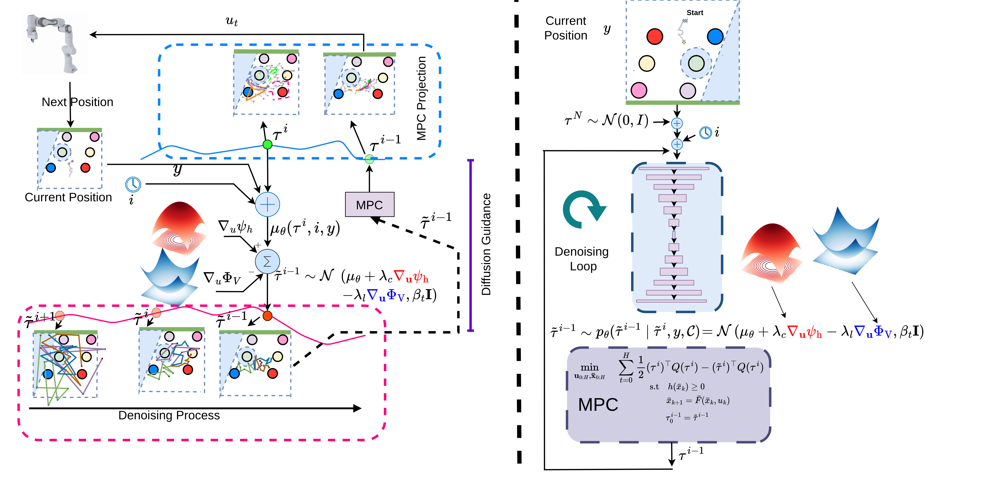
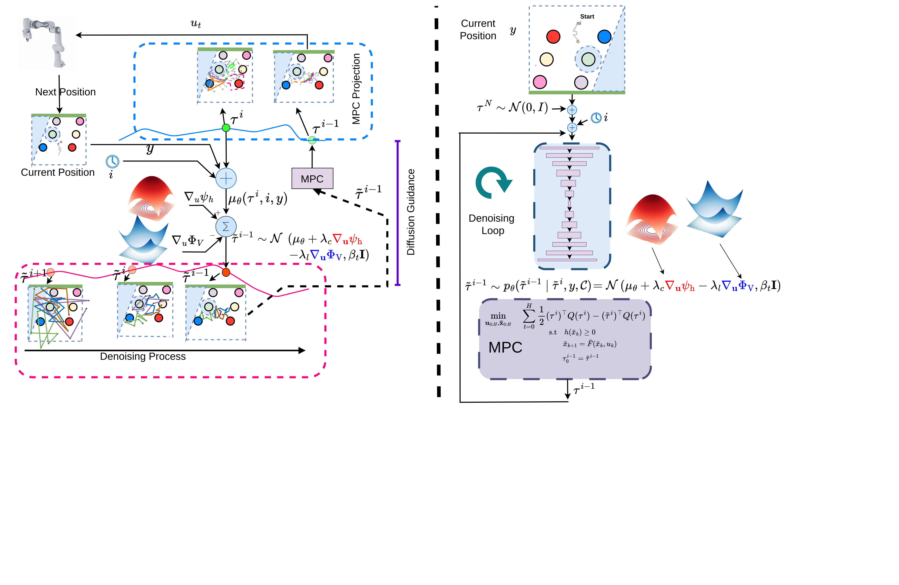
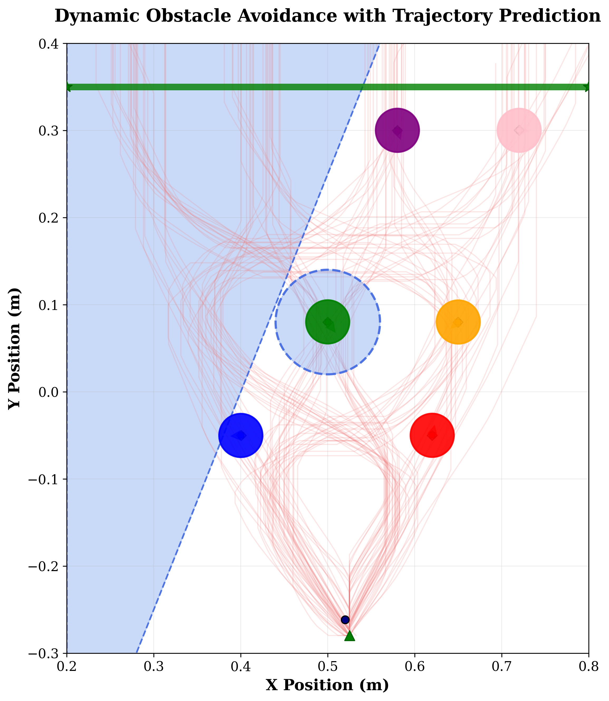
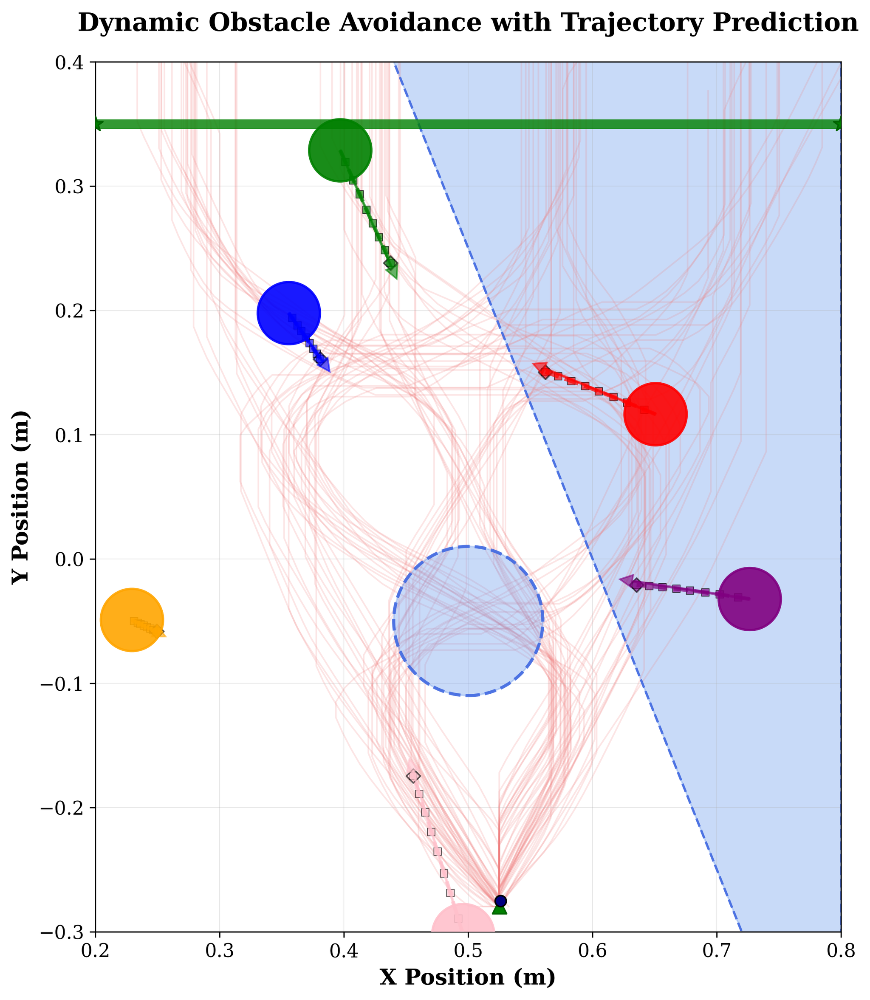
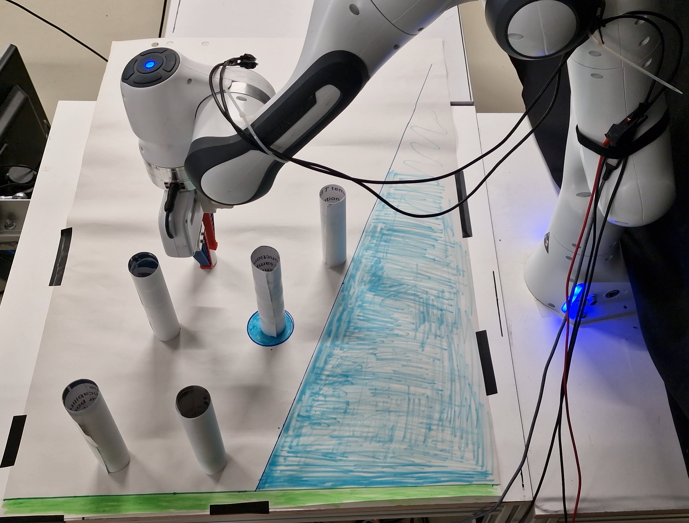
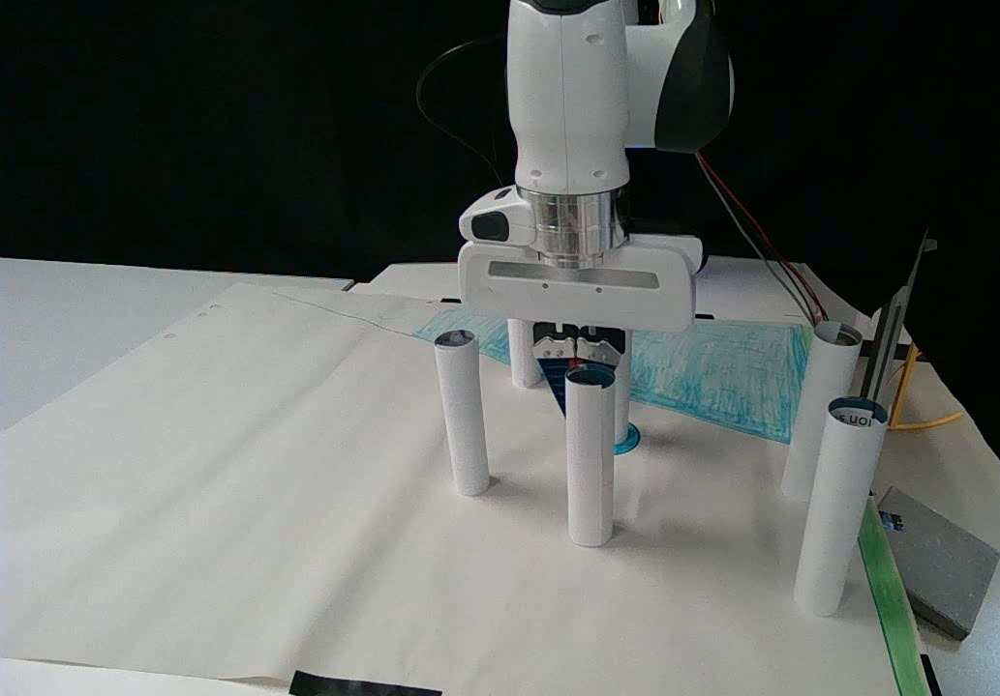
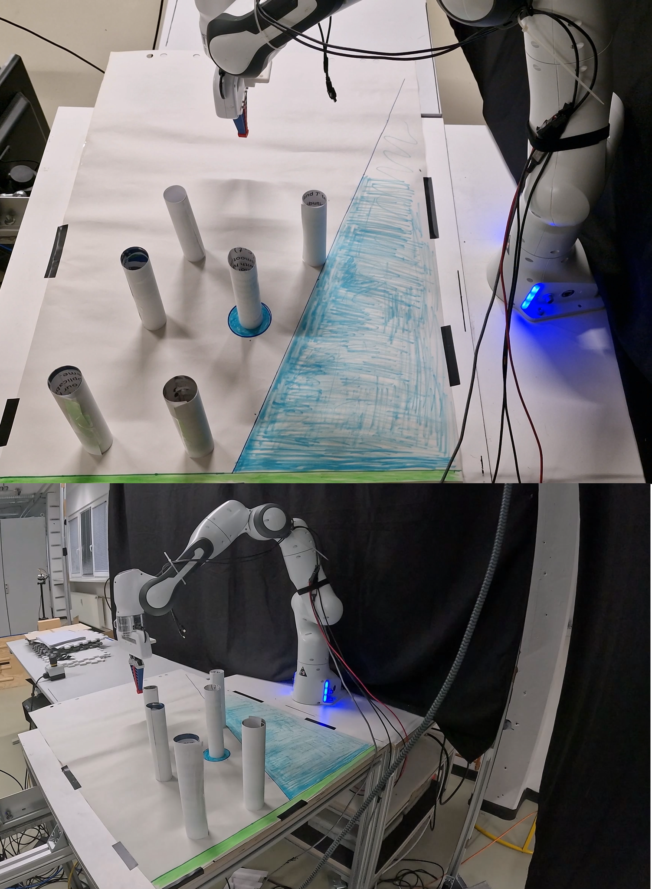
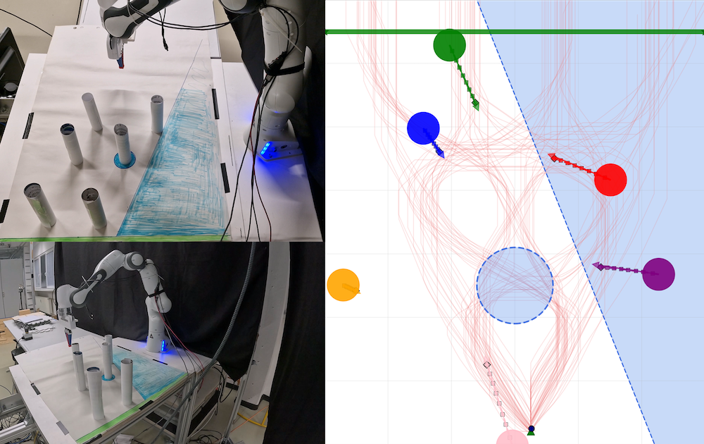
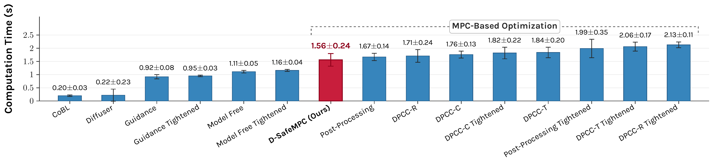

<div align="center">

# D-SafeMPC: Diffusion-Driven Safe Model Predictive Control with Discrete-Time Control Barrier Functions

<p align="center">
<strong>Official PyTorch Implementation</strong>
</p>

<p align="center">
<strong>2026 IEEE/RSJ International Conference on Intelligent Robots and Systems (IROS 2026)</strong><br>
<em>Accepted & Presented at IROS 2026, Pittsburgh, PA, USA</em>
</p>

<p align="center">
<a href="https://erdisayar.github.io/">Erdi Sayar</a><sup>1</sup> &nbsp;•&nbsp;
<a href="https://ersindas.github.io/">Ersin Daş</a><sup>2</sup> &nbsp;•&nbsp;
<a href="https://mae.caltech.edu/people/joel-w-burdick">Joel W. Burdick</a><sup>3</sup> &nbsp;•&nbsp;
<a href="https://www.ce.cit.tum.de/air/people/prof-dr-ing-habil-alois-knoll/">Alois Knoll</a><sup>4</sup> &nbsp;•&nbsp;
<a href="https://erdalkayacan.github.io/">Erdal Kayacan</a><sup>1</sup>
</p>

<p align="center">
<sup>1</sup>Paderborn University, Germany &nbsp;|&nbsp;
<sup>2</sup>Illinois Institute of Technology, USA &nbsp;|&nbsp;
<sup>3</sup>California Institute of Technology (Caltech), USA &nbsp;|&nbsp;
<sup>4</sup>Technical University of Munich (TUM), Germany
</p>

<p align="center">
<a href="https://arxiv.org/abs/2607.10842"></a>
<a href="https://arxiv.org/pdf/2607.10842"></a>
<a href="https://2026.ieee-iros.org/"></a>
<a href="LICENSE"></a>


</p>

---

</div>

## 📌 Overview

Diffusion models have recently achieved prominent success in robot motion planning by casting trajectory generation as probabilistic inference. By learning from human demonstrations, diffusion models synthesize diverse, multimodal trajectories in complex environments. However, **standard unconstrained diffusion models lack intrinsic mechanisms to enforce explicit safety and dynamical constraints**, frequently yielding physically infeasible or colliding plans in constrained scenarios.

Existing hybrid frameworks attempt to address these limitations through two primary paradigms:
1. **Guidance-only methods** (e.g., CoBL): incorporate safety penalties as soft gradients during reverse diffusion, but provide **no strict feasibility or forward invariance guarantees**.
2. **Sequential MPC projection methods** (e.g., DPCC): enforce hard constraints by projecting diffusion outputs via Model Predictive Control (MPC). However, they are sensitive to poor initialization, often trapping the optimizer in **local minima**, suffer from an $\mathcal{O}(\mathcal{B})$ **sequential runtime bottleneck**, and rely on **ad-hoc single-criterion selection heuristics** (e.g., random selection or minimum projection cost).

<div align="center">

<p><em>Figure 1: Architecture of D-SafeMPC. Analytical discrete-time Control Barrier Functions (CBFs) and Control Lyapunov Functions (CLFs) guide the intermediate reverse diffusion process. During burn-in timesteps, an embedded MPC solver projects candidates onto the safe, dynamically feasible set, anchoring samples in the feasible basin of attraction before Pareto-optimal selection.</em></p>
</div>

**D-SafeMPC** overcomes these fundamental limitations through a unified framework bridging generative diffusion, control-theoretic safety, and mathematical optimization:

- 🧭 **Guided Reverse Diffusion via Discrete-Time CBFs & CLFs:** Analytical gradients derived from discrete-time Control Barrier Functions (CBFs) and Control Lyapunov Functions (CLFs) steer the reverse denoising process directly toward safe, goal-directed regions of the state space, providing reliable warm starts for numerical optimization.
- 🛡️ **Iterative MPC Feasibility Projection:** An embedded MPC solver projects guided candidate trajectories onto the safe and dynamically feasible set during intermediate denoising steps, strictly enforcing obstacle avoidance, actuator boundaries, and kinematic constraints.
- ⚡ **High-Quality Warm Starts & Divergence Prevention:** By seeding optimization with CBF/CLF-guided diffusion proposals, D-SafeMPC drastically reduces SQP solver iterations and eliminates solver divergence in cluttered environments.
- 🎯 **Pareto-Optimal Trajectory Selection with Adaptive CBF Blending:** Constructs a non-dominated Pareto front over safety margins (CBF) and goal convergence (CLF), dynamically interpolating between safe backup and goal-seeking candidates via continuous margin-adaptive blending.
- 🔄 **Obstacle-Agnostic Prior (Zero Retraining):** The diffusion model is trained offline strictly on obstacle-free demonstrations. Safe navigation around arbitrary static and dynamic obstacles is enforced entirely at runtime without retraining.

<div align="center">

<p><em>Figure 2: Overview of the closed-loop denoising-projection cycle and Pareto selection pipeline. Intermediate diffusion candidates are guided and projected during burn-in steps ($i \le N/2$), certified along the prediction horizon, and filtered via continuous Pareto blending for receding-horizon execution.</em></p>
</div>

---

## 🚀 Key Highlights

- **Control-Theoretic Safety Guarantees:** Unifies generative diffusion with discrete-time Control Barrier Functions (CBFs) and Control Lyapunov Functions (CLFs), providing forward invariance and asymptotic goal convergence.
- **Plug-and-Play Generalization:** Offline training requires only obstacle-free demonstration trajectories. Constraint satisfaction and obstacle avoidance are decoupled and enforced during inference, adapting seamlessly to unseen layouts without neural network retraining.
- **Analytical Gradient Guidance:** Exploits closed-form Jacobians ($\nabla_{\mathbf{u}}\psi_h$ and $\nabla_{\mathbf{u}}\Phi_V$) to steer Gaussian reverse transitions, preventing the solver from being trapped in infeasible local minima.
- **Selective Burn-In MPC Projection:** Activates MPC projection during intermediate denoising steps ($i \le N/2$), achieving up to **40% lower computational latency** compared to projecting every reverse diffusion step while preserving maximal ensemble diversity.
- **Principled Multi-Objective Pareto Selection:** Replaces ad-hoc scalarization or random heuristics with an explicit Pareto front in $(\mathcal{J}_{\text{CBF}}, \mathcal{J}_{\text{CLF}})$ space, paired with continuous CBF margin-based blending $\mu_t = \exp(-\eta \max\{h_I, 0\})$.
- **Real-Time Efficiency:** Achieves **1.56 ± 0.24 s** decision latency—**27% faster** than DPCC-R Tightened and **24% faster** than DPCC-T Tightened—while sustaining high success rates across dynamic scenes.
- **Extensive Simulation & Sim-to-Real Hardware Transfer:** Evaluated in high-fidelity MuJoCo simulations across 4 benchmark environments (static and fast dynamic obstacles up to $0.4\,\text{m/s}$) and deployed zero-shot on physical hardware (a 7-DoF Franka Emika Panda manipulator and a physical ground robot).

---

## 🔬 Theoretical Framework & Methodology

### 1. Discrete-Time Augmented System Dynamics
To handle robotic navigation among $N_J$ dynamic obstacles, we consider the augmented discrete-time nonlinear system:
$$\bar{\mathbf{x}}_{k+1} = \bar{\mathbf{F}}(\bar{\mathbf{x}}_k, \mathbf{u}_k) \triangleq \begin{bmatrix} \mathbf{f}(\mathbf{x}_k, \mathbf{u}_k) \\ \mathbf{f}_1(\mathbf{x}_{1,k}) \\ \vdots \\ \mathbf{f}_{N_J}(\mathbf{x}_{N_J,k}) \end{bmatrix}, \quad \bar{\mathbf{x}} = [\mathbf{x}^\top, \mathbf{x}_1^\top, \dots, \mathbf{x}_{N_J}^\top]^\top \in \mathbb{R}^{\bar{n}}$$
where $\mathbf{x} \in \mathcal{X} \subset \mathbb{R}^n$ denotes the robot state, $\mathbf{u} \in \mathcal{U} \subset \mathbb{R}^m$ is the control input (satisfying actuator saturation limits), and $\mathbf{x}_j \in \mathbb{R}^{n_j}$ denotes the state of dynamic obstacle $j \in \{1,\dots,N_J\}$.

### 2. Discrete-Time Control Barrier Functions (CBFs)
For $N_J$ obstacles with radius $r_j$, we construct a smooth softmin safety function:
$$h(\bar{\mathbf{x}}) \triangleq -\frac{1}{\lambda} \ln \sum_{j=1}^{N_J} \exp\left(-\lambda (\|\mathbf{x} - \mathbf{x}_j\|^2 - r_j^2)\right)$$
Forward invariance of the safe set $\mathcal{C} = \{\bar{\mathbf{x}} \mid h(\bar{\mathbf{x}}) \ge 0\}$ is certified via the discrete-time CBF condition:
$$\psi_h(\bar{\mathbf{x}}_k, \mathbf{u}_k) \triangleq h(\bar{\mathbf{F}}(\bar{\mathbf{x}}_k, \mathbf{u}_k)) - h(\bar{\mathbf{x}}_k) + \alpha(h(\bar{\mathbf{x}}_k)) \ge 0, \quad 0 < \alpha \le 1$$

### 3. Discrete-Time Control Lyapunov Functions (CLFs)
To ensure goal convergence toward target $g \in \mathcal{G}$, we formulate the discrete-time exponential CLF:
$$V(\bar{\mathbf{x}}) \triangleq \|\bar{\mathbf{x}} - g\|^2$$
with the finite-horizon decay requirement:
$$\Phi_V(\bar{\mathbf{x}}_k, \mathbf{u}_k) \triangleq V(\bar{\mathbf{F}}(\bar{\mathbf{x}}_k, \mathbf{u}_k)) - V(\bar{\mathbf{x}}_k) + \gamma V(\bar{\mathbf{x}}_k) \le 0, \quad 0 < \gamma < 1$$

### 4. Classifier-Guided Reverse Sampling
Rather than sampling unguided noise, analytical gradients steer intermediate reverse diffusion transitions:
$$p_\theta(\tilde{\boldsymbol{\tau}}^{i-1} \mid \tilde{\boldsymbol{\tau}}^i, \mathbf{x}_t) = \mathcal{N}\left(\boldsymbol{\mu}_\theta(\boldsymbol{\tau}^i, i, \mathbf{x}_t) + \lambda_c \nabla_{\mathbf{u}}\psi_h - \lambda_l \nabla_{\mathbf{u}}\Phi_V, \; \beta_i \mathbf{I}\right)$$
where the analytical input gradients are computed using the chain rule:
$$\nabla_{\mathbf{u}}\psi_h = \left(\frac{\partial \bar{\mathbf{F}}}{\partial \mathbf{u}}\right)^\top \nabla_{\bar{\mathbf{x}}} h, \qquad \nabla_{\mathbf{u}}\Phi_V = \left(\frac{\partial \bar{\mathbf{F}}}{\partial \mathbf{u}}\right)^\top \nabla_{\bar{\mathbf{x}}} V$$
An adaptive weighting mechanism dynamically inflates $\lambda_c$ near obstacle boundaries, ensuring safety strictly dominates goal progress when clearance diminishes.

### 5. Iterative MPC Feasibility Projection
During intermediate burn-in steps ($i \le N/2$), each candidate $\tilde{\boldsymbol{\tau}}^{i-1}$ is projected onto the strictly feasible set via MPC:
$$\begin{aligned}
\min_{\mathbf{x}_{0:H}, \mathbf{u}_{0:H-1}} \quad & \frac{1}{2} \|\boldsymbol{\tau} - \tilde{\boldsymbol{\tau}}^i\|_{\mathbf{Q}}^2 = \frac{1}{2}\sum_{k=0}^H \|\mathbf{x}_k - \tilde{\mathbf{x}}_k^i\|_{\mathbf{Q}_x}^2 + \frac{1}{2}\sum_{k=0}^{H-1} \|\mathbf{u}_k - \tilde{\mathbf{u}}_k^i\|_{\mathbf{Q}_u}^2 \\
\text{s.t.} \quad & h(\bar{\mathbf{x}}_k) \ge 0, \quad \forall k \in \{0,\dots,H\}, \\
& \bar{\mathbf{x}}_{k+1} = \bar{\mathbf{F}}(\bar{\mathbf{x}}_k, \mathbf{u}_k), \quad \forall k \in \{0,\dots,H-1\}, \\
& \mathbf{u}_k \in \mathcal{U}, \quad \forall k \in \{0,\dots,H-1\}, \\
& \mathbf{x}_0 = \mathbf{x}_t
\end{aligned}$$
Projected trajectories are fed back into subsequent reverse diffusion steps, locking trajectories into the feasible basin of attraction.

### 6. Pareto-Optimal Selection & Continuous CBF Blending
Given the batch of $\mathcal{B}$ feasible candidate trajectories, each trajectory is evaluated over the horizon:
$$\mathcal{J}_{\text{CBF}}^b \triangleq \sum_{j=1}^{N_J} \sum_{k=0}^{H-1} \bigl[ h_j(\mathbf{z}_{j,k+1}) - (1 - \alpha_{\text{cbf}}) h_j(\mathbf{z}_{j,k}) \bigr], \qquad \mathcal{J}_{\text{CLF}}^b \triangleq \sum_{k=0}^{H-1} \bigl[ V(\mathbf{x}_{k+1}) - (1 - \sigma) V(\mathbf{x}_k) \bigr]$$
1. Construct the non-dominated **Pareto front** $\mathcal{P}_t$ in $(\mathcal{J}_{\text{CBF}}, \mathcal{J}_{\text{CLF}})$ space.
2. Identify the backup candidate $b_{\mathrm{b}} \triangleq \arg\max_{b \in \mathcal{P}_t} \mathcal{J}_{\text{CBF}}^b$ and primary candidate $b_{\mathrm{p}} \triangleq \arg\min_{b \in \mathcal{P}_t} \mathcal{J}_{\text{CLF}}^b$.
3. Compute the margin-adaptive blending coefficient:
   $$\mu_t = \exp\left(-\eta \max\{h_I, 0\}\right), \quad \text{where } h_I \triangleq \min_{b \in \mathcal{P}_t} \text{CBF}^b_t$$
4. Compute the virtual reference $\boldsymbol{\tau}_{\text{ref}} = (1 - \mu_t)\boldsymbol{\tau}^{b_{\mathrm{p}}} + \mu_t \boldsymbol{\tau}^{b_{\mathrm{b}}}$ and execute the nearest Pareto-optimal candidate:
   $$b^* = \arg\min_{b \in \mathcal{P}_t} \|\boldsymbol{\tau}^b - \boldsymbol{\tau}_{\text{ref}}\|_{\mathbf{Q}}^2, \qquad \mathbf{u}^*_t = \mathbf{u}^{b^*}_{t,0}$$

---

## 🎬 D-SafeMPC in Action: Qualitative & Hardware Evaluations

### 1. Navigation in Static & Dynamic Environments
Under complex obstacle corridors and high-speed dynamic obstacles, D-SafeMPC smoothly navigates around obstacles without colliding, whereas unconstrained diffusion and baseline heuristics suffer severe constraint violations:

<div align="center">
<table>
  <tr>
    <td align="center" width="50%">
      <br>
      <em>(a) Static obstacle navigation with safety boundary constraints.</em>
    </td>
    <td align="center" width="50%">
      <br>
      <em>(b) Dynamic obstacle navigation under continuous obstacle motion.</em>
    </td>
  </tr>
</table>
</div>

### 2. Sim-to-Real Hardware Deployment
D-SafeMPC was validated via zero-shot transfer on both a 7-DoF Franka Emika Panda robotic manipulator and an indoor physical ground robot tracked by a 12-camera OptiTrack motion capture system at 100 Hz:

<div align="center">
<table>
  <tr>
    <td align="center" width="50%">
      <br>
      <em>(a) Physical Franka Emika Panda setup with workspace obstacles and target line.</em>
    </td>
    <td align="center" width="50%">
      <br>
      <em>(b) Closed-loop trajectory execution avoiding obstacles in real time.</em>
    </td>
  </tr>
  <tr>
    <td align="center" width="50%">
      <br>
      <em>(c) Indoor laboratory arena with OptiTrack tracking and physical obstacles.</em>
    </td>
    <td align="center" width="50%">
      <br>
      <em>(d) Real-world reactive obstacle avoidance under moving obstacles.</em>
    </td>
  </tr>
</table>
</div>

### 3. Computational Efficiency & Latency Scaling
By steering reverse diffusion with analytical CBF/CLF guidance, D-SafeMPC initializes the MPC solver in close proximity to the feasible manifold, dramatically cutting SQP iterations and total decision latency:

<div align="center">

<p><em>Figure 3: Decision latency across planners. D-SafeMPC achieves an optimal speed-safety frontier (1.56 ± 0.24 s), outperforming sequential tightened baselines by up to 27% while guaranteeing zero safety violations.</em></p>
</div>

---

## 📂 Repository Structure

```plaintext
D-SafeMPC/
├── assets/                          # Architectural diagrams, figures, and hardware experiment photos
│   ├── d_safempc_architecture.png   # Architectural schematic of D-SafeMPC
│   ├── graphical_abstract.png       # Closed-loop denoising-projection pipeline overview
│   ├── static_env.png               # Qualitative trajectory comparisons in static scenes
│   ├── dynamic_env.png              # Trajectory plots in dynamic obstacle scenarios
│   ├── computation_time.png         # Latency and runtime scaling comparisons
│   ├── franka_setup.jpg             # Physical Franka Emika Panda setup
│   ├── franka_execution.jpg         # Real-robot Franka trajectory execution
│   ├── real_experiment_image.png    # Ground robot arena setup
│   └── real_experiment_dynamic_obs.png # Ground robot dynamic obstacle avoidance
├── config/                          # Experiment and training YAML / Python configurations
│   ├── projection_eval.yaml         # Main evaluation config (obstacles, seeds, projection variants)
│   └── avoiding-d3il.py             # Hyperparameter settings for diffusion model training
├── d3il/                            # D3IL benchmark and simulation environment
│   ├── environments/d3il/           # Gym avoiding environments and MuJoCo models
│   ├── simulation/                  # Simulation runtimes and base simulators
│   └── agents/                      # Baseline agent definitions (BC, DDPM, CVAE, etc.)
├── diffuser/                        # Temporal U-Net diffusion model and control modules
│   ├── models/                      # Diffusion architectures (UNet1D, GaussianDiffusion, reward functions)
│   ├── sampling/                    # Policy execution, CBF/CLF guidance, and MPC projection
│   │   ├── policies.py              # Sampling policy and trajectory selection logic
│   │   └── projection.py            # Feasibility projector (CBF, dynamic, polytopic constraints)
│   ├── datasets/                    # Demonstration dataset loaders, normalizers, and buffers
│   └── utils/                       # Progress loggers, plotting helpers, and serialization
├── figures/                         # Generated data distribution and constraint visualizations
├── scripts/                         # Command-line entrypoints for training, eval, and visualization
│   ├── train.py                     # Offline diffusion policy training script
│   ├── eval.py                      # Main evaluation script (dynamic/static trajectory evaluation)
│   ├── load_results.py              # Publication results loader and aggregator
│   ├── analyze_my_results.py        # Statistical analyzer generating plots and LaTeX tables
│   ├── visualize_data_constraints.py# Dataset and halfspace constraint visualizer
│   └── visualize.py                 # Multi-seed trial trajectory plotting utility
├── trajectory_generator.py          # Parametric dynamic/static obstacle trajectory generator
├── video_generator.py               # Video rendering script from saved evaluation rollouts
├── plot_expert_dataset.py           # Demonstration dataset inspection tool
├── load_saved_results.py            # Quick-start script to load saved evaluation logs
├── requirements.txt                 # Full pip dependency list
└── LICENSE                          # MIT License
```

---

## 🛠️ Setup & Installation

### 1. Conda Environment
Create a clean Conda environment with Python 3.10:
```bash
conda create -n dsafempc python=3.10 -y
conda activate dsafempc
```

### 2. Install PyTorch
Install PyTorch compatible with your CUDA setup (example below for CUDA 12.1 / 12.4):
```bash
pip install torch torchvision --index-url https://download.pytorch.org/whl/cu124
```

### 3. Install Core Dependencies
Install the required system and scientific Python packages:
```bash
pip install -r requirements.txt
```

### 4. Install Diffuser and D3IL Packages
Install the custom packages in editable mode:
```bash
# Install the diffuser module
pip install -e diffuser/

# Install the D3IL simulation environment
cd d3il/environments/d3il && pip install -e . && cd ../../..
```

### 5. Verify MuJoCo Installation
Verify that MuJoCo and the graphics backend are properly detected:
```bash
python -c "import mujoco; print('MuJoCo version:', mujoco.__version__)"
```

---

## 🚦 Training & Usage Guide

### Phase 1: Visualize Demonstration Data & Constraints
Inspect the expert demonstrations collected by human teleoperation and visualize the safety boundaries:
```bash
python plot_expert_dataset.py
python scripts/visualize_data_constraints.py
```

### Phase 2: Train the Diffusion Prior
Train the temporal 1D U-Net diffusion policy on demonstration trajectories. The model is trained purely on obstacle-free data, acting as an environment-agnostic behavioral prior:
```bash
python scripts/train.py
```
*Note: Training logs and model checkpoints are automatically stored in `logs/diffusion/`.*

### Phase 3: Generate Dynamic / Static Obstacle Trajectories
Generate reproducible obstacle trajectories with customized seeds and motion dynamics:
```bash
python trajectory_generator.py
```

### Phase 4: Run Evaluation Benchmarks
Evaluate D-SafeMPC and baseline planners across static and dynamic environments:
```bash
python scripts/eval.py
```
Experiment parameters can be adjusted directly in `config/projection_eval.yaml`:
- `trajectory_type`: Choose between `'static'` or `'dynamic'` obstacle motion.
- `projection_variants`: Specify planners to evaluate (e.g., `'diffmpc'`, `'dpcc-t-tightened'`, `'dpcc-c'`, `'dpcc-r'`).
- `seeds`: List of evaluation seeds for statistical significance (e.g., `[0, 1, 2, 3, 4, 5, 6, 7, 8, 9]`).
- `n_trials`: Number of evaluation trials per configuration.

### Phase 5: Result Analysis & Publication Figures
Process evaluation logs, compute statistical metrics, and generate publication-ready tables and plots:
```bash
# Analyze logged evaluation runs
python scripts/load_results.py

# Generate publication bar charts, LaTeX tables, and reports
python load_saved_results.py
```

### Phase 6: Render Simulation Videos
Render high-resolution video recordings of evaluation trials:
```bash
python video_generator.py
```

---

## 📊 Benchmark Results

### 1. Planning Performance (SCGR & GR) Across Benchmark Scenarios
We evaluate **Safety-Compliant Goal Reached Rate (SCGR)** (reaching the target with **zero** collisions) and **Goal Reached Rate (GR)** across 10 random seeds with 20 evaluations per method:

| Planner | Static (SCGR $\uparrow$) | Static (GR $\uparrow$) | Dyn. 1 (SCGR $\uparrow$) | Dyn. 1 (GR $\uparrow$) | Dyn. 2 (SCGR $\uparrow$) | Dyn. 2 (GR $\uparrow$) | Dyn. 3 (SCGR $\uparrow$) | Dyn. 3 (GR $\uparrow$) |
| :--- | :---: | :---: | :---: | :---: | :---: | :---: | :---: | :---: |
| **D-SafeMPC (Ours)** | **0.80 ± 0.33** | **0.80 ± 0.33** | **1.00 ± 0.00** | **1.00 ± 0.00** | **0.88 ± 0.27** | **0.88 ± 0.27** | **0.93 ± 0.18** | **0.93 ± 0.18** |
| DPCC-C | 0.90 ± 0.30 | 0.90 ± 0.30 | 0.75 ± 0.34 | 0.85 ± 0.23 | 0.45 ± 0.42 | 0.60 ± 0.34 | 0.43 ± 0.33 | 0.43 ± 0.33 |
| DPCC-C$^\dagger$ (Tightened) | 0.70 ± 0.40 | 0.70 ± 0.40 | 0.70 ± 0.33 | 0.75 ± 0.25 | 0.58 ± 0.40 | 0.58 ± 0.40 | 0.65 ± 0.39 | 0.65 ± 0.39 |
| DPCC-R | 0.35 ± 0.39 | 0.50 ± 0.39 | 0.45 ± 0.35 | 0.65 ± 0.39 | 0.28 ± 0.30 | 0.33 ± 0.33 | 0.68 ± 0.29 | 0.83 ± 0.24 |
| DPCC-R$^\dagger$ (Tightened) | 0.70 ± 0.33 | 0.70 ± 0.33 | 0.80 ± 0.33 | 0.90 ± 0.30 | 0.60 ± 0.34 | 0.60 ± 0.34 | 0.75 ± 0.25 | 0.75 ± 0.25 |
| DPCC-T | 0.80 ± 0.33 | 0.95 ± 0.15 | 0.35 ± 0.32 | 0.50 ± 0.32 | 0.05 ± 0.15 | 0.05 ± 0.15 | 0.28 ± 0.33 | 0.30 ± 0.37 |
| DPCC-T$^\dagger$ (Tightened) | 0.85 ± 0.32 | 0.85 ± 0.32 | 0.45 ± 0.35 | 0.45 ± 0.35 | 0.13 ± 0.22 | 0.13 ± 0.22 | 0.35 ± 0.42 | 0.35 ± 0.42 |
| CoBL (IROS '24) | 0.05 ± 0.15 | 1.00 ± 0.00 | 0.10 ± 0.30 | 0.85 ± 0.32 | 0.78 ± 0.37 | 0.93 ± 0.24 | 0.80 ± 0.33 | 0.85 ± 0.32 |
| Diffuser (ICML '22) | 0.05 ± 0.15 | 0.65 ± 0.45 | 0.20 ± 0.33 | 0.40 ± 0.44 | 0.18 ± 0.33 | 0.33 ± 0.43 | 0.33 ± 0.43 | 0.45 ± 0.42 |
| Guidance (T-RO '25) | 0.40 ± 0.49 | 0.40 ± 0.49 | 0.40 ± 0.49 | 0.40 ± 0.49 | 0.53 ± 0.49 | 0.53 ± 0.49 | 0.53 ± 0.49 | 0.53 ± 0.49 |
| Model-Free (ICRA-W '24) | 0.00 ± 0.00 | 0.55 ± 0.42 | 0.35 ± 0.45 | 0.45 ± 0.47 | 0.23 ± 0.37 | 0.30 ± 0.40 | 0.35 ± 0.42 | 0.45 ± 0.42 |
| Post-Proc. (NeurIPS '23) | 0.55 ± 0.35 | 0.75 ± 0.34 | 0.55 ± 0.35 | 0.60 ± 0.30 | 0.40 ± 0.37 | 0.43 ± 0.40 | 0.55 ± 0.35 | 0.73 ± 0.30 |

> *$^\dagger$ Denotes tightened constraint variants. Best results in each column are in bold.*

### 2. Planning Performance: Success Rate (SR) and Safety Violations (SV)
Evaluating mean $\pm$ std of **Success Rate (SR)** ($\uparrow$) and **Safety Violation (SV)** ($\downarrow$) across four complex navigation configurations:

| Planner | Static Env 1 (SR $\uparrow$ / SV $\downarrow$) | Static Env 2 (SR $\uparrow$ / SV $\downarrow$) | Dynamic Env 3 (SR $\uparrow$ / SV $\downarrow$) | Dynamic Env 4 (SR $\uparrow$ / SV $\downarrow$) | Reference |
| :--- | :---: | :---: | :---: | :---: | :---: |
| **D-SafeMPC (Ours)** | **0.90 ± 0.20** / **0.00 ± 0.00** | **0.75 ± 0.34** / **0.00 ± 0.00** | **0.80 ± 0.33** / **0.049 ± 0.15** | **0.55 ± 0.47** / **0.060 ± 0.11** | — |
| DPCC-C | 0.60 ± 0.37 / 0.015 ± 0.046 | 0.45 ± 0.42 / 0.240 ± 0.430 | 0.70 ± 0.33 / 0.119 ± 0.270 | 0.25 ± 0.34 / 0.012 ± 0.029 | L4DC '25 |
| DPCC-C Tight.$^\dagger$ | 0.50 ± 0.45 / 0.004 ± 0.012 | 0.45 ± 0.42 / 0.140 ± 0.290 | 0.80 ± 0.33 / 0.120 ± 0.280 | 0.25 ± 0.34 / 0.002 ± 0.006 | L4DC '25 |
| DPCC-R | 0.45 ± 0.42 / 0.012 ± 0.029 | 0.20 ± 0.33 / 0.000 ± 0.000 | 0.80 ± 0.33 / 0.117 ± 0.180 | 0.15 ± 0.32 / 0.110 ± 0.240 | L4DC '25 |
| DPCC-R Tight.$^\dagger$ | 0.40 ± 0.44 / 0.000 ± 0.000 | 0.25 ± 0.34 / 0.033 ± 0.098 | 0.70 ± 0.24 / 0.305 ± 0.480 | 0.20 ± 0.24 / 0.180 ± 0.350 | L4DC '25 |
| DPCC-T | 0.50 ± 0.39 / 0.005 ± 0.014 | 0.45 ± 0.47 / 0.008 ± 0.021 | 0.70 ± 0.33 / 0.033 ± 0.068 | 0.20 ± 0.33 / 0.046 ± 0.120 | L4DC '25 |
| DPCC-T Tight.$^\dagger$ | 0.60 ± 0.44 / 0.001 ± 0.003 | 0.40 ± 0.44 / 0.000 ± 0.001 | 0.80 ± 0.33 / 0.039 ± 0.091 | 0.20 ± 0.33 / 0.022 ± 0.061 | L4DC '25 |
| CoBL | 0.45 ± 0.47 / 0.000 ± 0.000 | 0.45 ± 0.47 / 13.59 ± 14.43 | 0.00 ± 0.00 / 0.000 ± 0.000 | 0.25 ± 0.34 / 8.650 ± 10.88 | IROS '24 |
| Diffuser | 0.00 ± 0.00 / 0.440 ± 1.320 | 0.00 ± 0.00 / 8.410 ± 3.660 | 0.00 ± 0.00 / 0.003 ± 0.008 | 0.10 ± 0.30 / 1.570 ± 2.940 | ICML '22 |
| Guidance | 0.40 ± 0.37 / 21.35 ± 64.05 | 0.35 ± 0.32 / 35.42 ± 29.99 | 0.25 ± 0.34 / 18.27 ± 53.12 | 0.40 ± 0.37 / 19.31 ± 16.29 | T-RO '25 |
| Guidance Tight.$^\dagger$ | 0.35 ± 0.39 / 4.350 ± 13.06 | 0.40 ± 0.37 / 49.86 ± 58.51 | 0.50 ± 0.32 / 3.210 ± 9.550 | 0.35 ± 0.39 / 24.93 ± 24.73 | T-RO '25 |
| Model-Free | 0.15 ± 0.32 / 0.650 ± 1.420 | 0.10 ± 0.30 / 0.460 ± 0.790 | 0.55 ± 0.47 / 0.591 ± 0.790 | 0.35 ± 0.45 / 3.950 ± 9.870 | ICRA-W '24 |
| Post-Proc. | 0.45 ± 0.42 / 0.012 ± 0.029 | 0.20 ± 0.33 / 0.000 ± 0.000 | 0.80 ± 0.33 / 0.117 ± 0.180 | 0.15 ± 0.32 / 0.110 ± 0.240 | NeurIPS '23 |

### 3. Computational Latency Comparison
| Planner Method | Decision Latency [s] | Speedup vs. DPCC Tightened | Dynamic SCGR |
| :--- | :---: | :---: | :---: |
| **D-SafeMPC (Ours)** | **1.56 ± 0.24** | **Baseline (Fastest)** | **> 88% across all scenarios** |
| DPCC-T Tightened | 2.06 ± 0.17 | +24% slower | 13% – 45% |
| DPCC-R Tightened | 2.13 ± 0.11 | +27% slower | 60% – 80% |

---

## 📑 Citation

If you find this work, codebase, or results helpful in your research, please cite our IROS 2026 paper:


```bibtex
@article{sayar2026dsafempcarxiv,
  title     = {D-SafeMPC: Diffusion-Driven Safe Model Predictive Control with Discrete-Time Control Barrier Functions},
  author    = {Sayar, Erdi and Da{\c{s}}, Ersin and Burdick, Joel W. and Knoll, Alois and Kayacan, Erdal},
  journal   = {arXiv preprint arXiv:2607.10842},
  year      = {2026},
  url       = {https://arxiv.org/abs/2607.10842}
}
```

---

## 🙏 Acknowledgements

This repository builds upon and integrates concepts and code from the following foundational works:
- [Diffuser](https://github.com/jannerm/diffuser): Planning with Diffusion for Flexible Behavior Synthesis (Janner et al., ICML 2022).
- [D3IL](https://github.com/ALRhub/d3il): Towards Diverse Behaviors: A Benchmark for Imitation Learning with Human Demonstrations (Jia et al., 2024).
- [Leap-c / acados](https://github.com/acados/acados): High-performance embedded nonlinear optimal control and batch QP solvers.

**Funding:** This work was partially supported by the European Union’s Horizon Europe research and innovation programme under Grant Agreement No. 101136056 (**SHEREC**). The authors also gratefully acknowledge the high-performance computing resources provided by the Paderborn Center for Parallel Computing (**PC2**) at Paderborn University.

---

## 📄 License

This project is licensed under the MIT License — see the [LICENSE](LICENSE) file for details.
